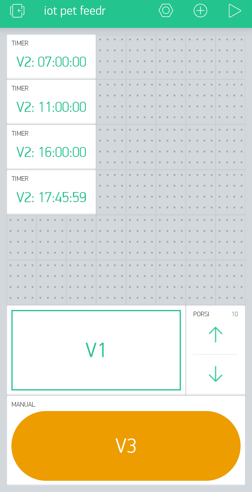
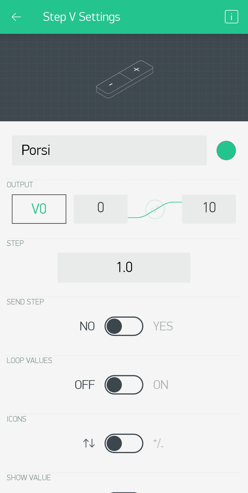

# Internet Of Things IOT Pet-Feeder BLynk

## BLYNK

## Application BLYNK Description 

* Widget Step V                : Pin Virtual 0
* Widget Styled                : Button Pin Virtual 1
* Widget Timer                 : Pin Virtual 2
* Widget Styled Button ' Manul : Pin Virtual 3

## CIRCUIT DIAGRAM